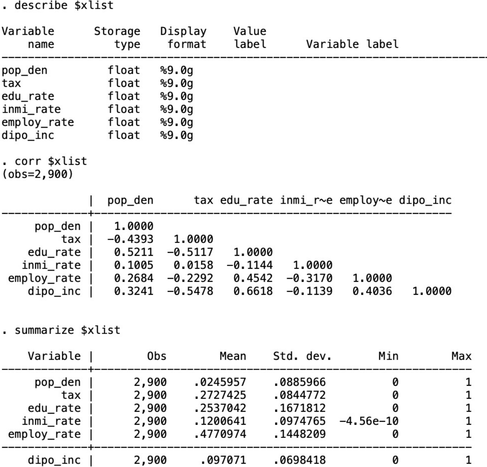
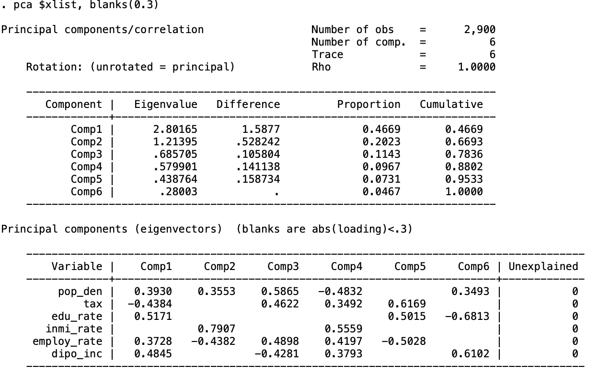
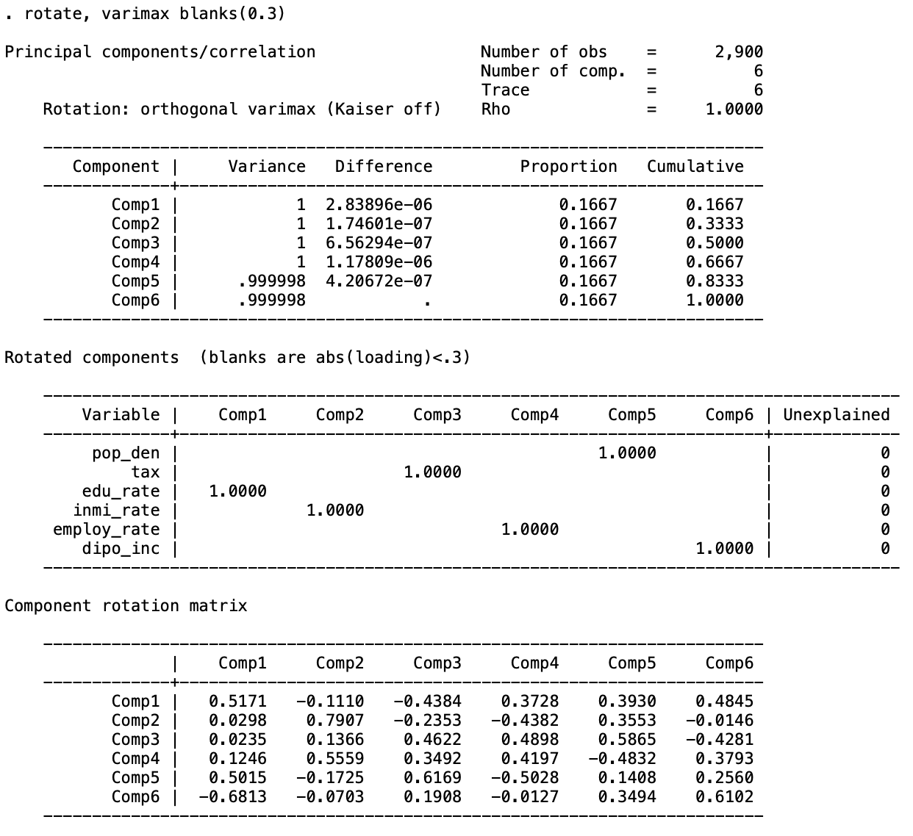

# PCA method by Stata
#### _Data source: Statistics Sweden(SCB)_ 
We are going to use the demographic data after [normalization](min-max_scaler.html). The analysis is used for my master thesis named "The Impact of Swedish Public Finance Factors on the Local Real Estate Market — Based on the GMM PVAR Approach" at KTH. The codes tutorial comes from [Principal Component Analysis and Factor Analysis in Stata](https://www.youtube.com/watch?v=xNTsAVj0t7U) by econometricsacademy.
```markdown
* use data1.dta, clear
# We set the panel data identifier here
* xtset code year
# now we look at the basic information of the dataset
* describe $xlist
* corr $xlist
* summarize $xlist
```


```markdown
* global xlist pop_den tax edu_rate inmi_rate employ_rate dipo_inc
* pca $xlist
```

we should choose two main components based on the eigenvalues >1. They can explain about 67% variance of the data.

The linear equations are:


_C1 = 0.3930*pop_den - 0.4384*tax + 0.5171*edu_rate - 0.1110*inmi_rate + 0.3728*employ_rate + 0.4845*dipo_inc_

_C2 = 0.3553*pop_den - 0.2353*tax + 0.0298*edu_rate + 0.7907*inmi_rate - 0.4382*employ_rate - 0.0146*dipo_inc_

```markdown
# we hide the items with loadings < 0.3, because that indicates they are not the dominant factors.
* pca $xlist, blanks(0.3)
```


we can see that for the first component, the tax has negative loadings. This is convinced by the previous empirical studies that more educated and more wealthy people usually choose to gather in the areas of greater economic concentration. The center of the city has more job opportunities so it will leads to higher employment rate as well. The disposable income is the after-tax income that people can use to save or spend, so at the same income level, the higher the tax rate, the lower people's disposable income.

```markdown
# we can draw the line plot of the eigenvalues.
* screeplot, yline(1)
```


```markdown
# If we rotate the matrix orthogonally and try to maximize the absolute value of the loadings' variance
* rotate, varimax blanks(0.3)
```

After rotation, the project loadings' contribution in each component is divided to the maximum extent possible. The dominant factor for the first component becomes the education rate.

```markdown
# we can estimate the loading scores after rotation
* estat loadings
* predict pc1 pc2 pc3, score
```


The first component score will be:
_PC1 = 1*std(edu_rate)_

We perform the KMO and Bartlett's Test for PCA analysis here. If the score is larger than 0.5 then the PCA is suitable.

```markdown
* estat kmo
```

The result is 0.73, so PCA is appropriate here.

