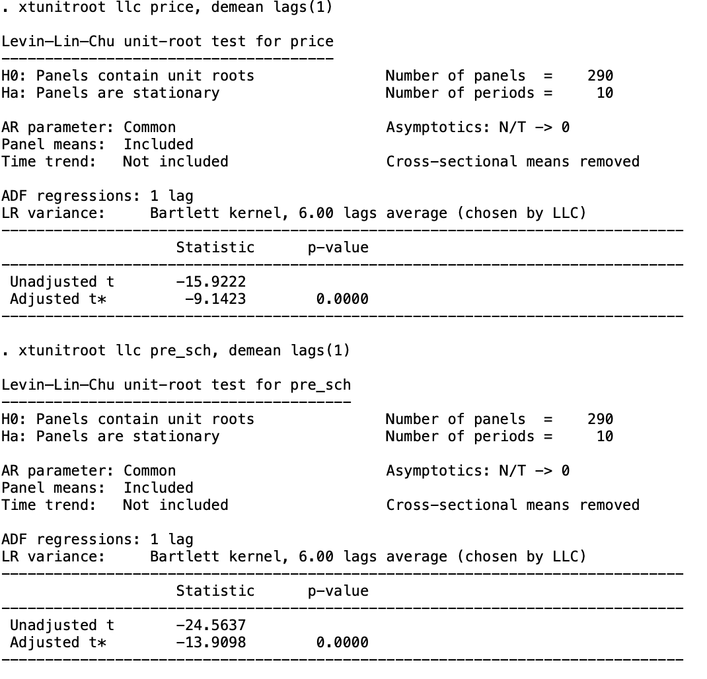
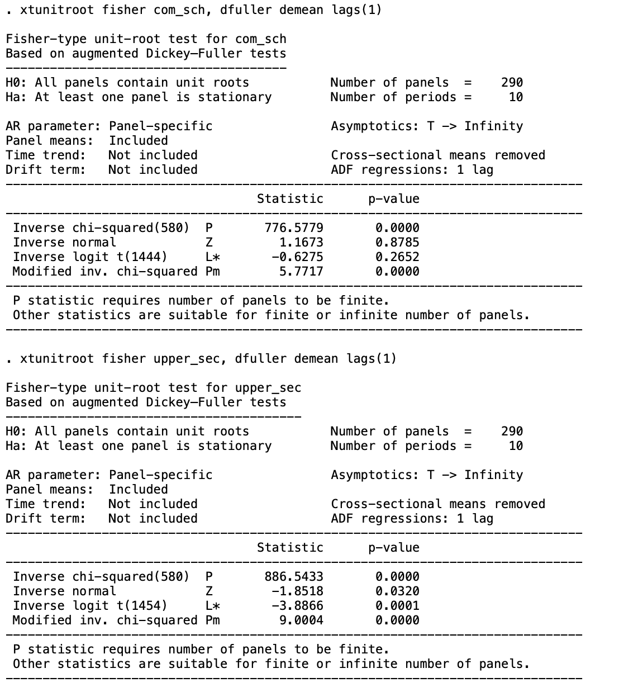
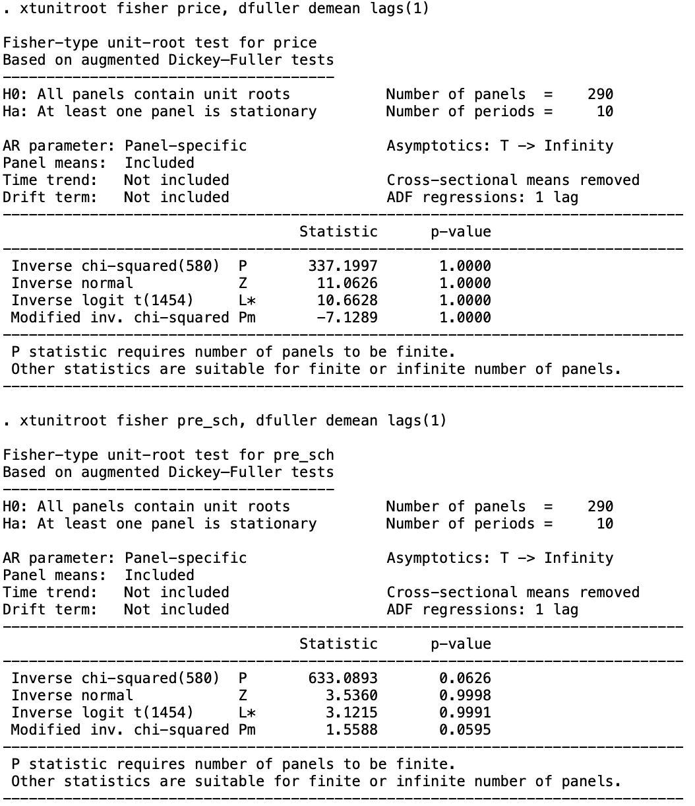
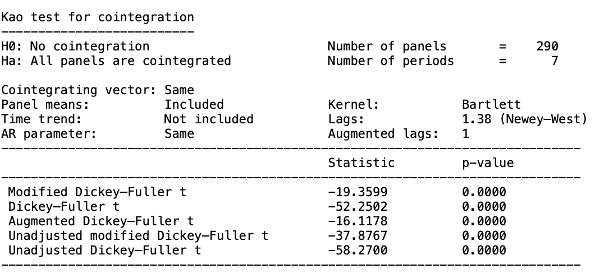
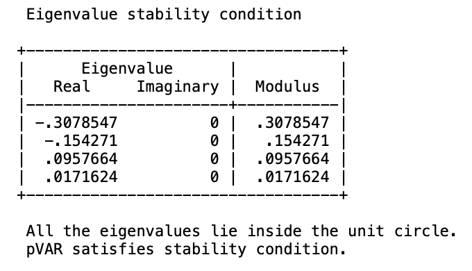

# PVAR model in Stata
_Data source: Statistics Sweden(SCB)_

We will build a PVAR model using government investment in education and house prices by municipality, with the aim of detecting which stage of investment in facilities has a positive stimulus on house prices. The time period is from 2011-2020 and the cross sections are 290 Swedish municipalities.


```markdown
* use data2.dta, clear
```
We set the panel data identifier here.
```markdown
* xtset code year
```
Panel variable: code (strongly balanced)

Time variable: year, 2011 to 2020
 
Delta: 1 unit

Before building the PVAR model, we need to do some diagnostic tests.

**1. Multicollinearity test**

Multicollinearity problems may occur in the linear regression models. It can leads to bias in the regression results due to the interaction between variables.
To ensure that this problem does not exist among the variables, the VIF factor is generally set to less than 5.
We first run a simple linear regression model as population density is the dependent variable.

```markdown
* regress price pre_sch com_sch upper_sec
* vif
```


All the VIF factors are smaller than 5, there is no multicollinearity problem.

**2. Unit root tests**

Most time series are volatile. We need run the panel unit root test to determine the stability of the data.
We first remove the cross-sectional dependence by the "_demean_" option. For the annually data, we set the lag = 1.

```markdown
* xtunitroot llc price, demean lags(1)
* xtunitroot llc pre_sch, demean lags(1)
* xtunitroot llc com_sch, demean lags(1)
* xtunitroot llc upper_sec, demean lags(1)
```
When the p-value is smaller than 0.05, we can reject the null hypothesis at 95% significant level, which means that the data is stationary.




For the common unit root test, all the variables are stationary at 95% significant level. Now we can check if they have the individual unit roots by performing the ADF test.

```markdown
* xtunitroot fisher price, dfuller demean lags(1)
* xtunitroot fisher pre_sch, dfuller demean lags(1)
* xtunitroot fisher com_sch, dfuller demean lags(1)
* xtunitroot fisher upper_sec, dfuller demean lags(1)
```



We cannot conclude that all variables are stationary based on the p-value > 0.05. 
The first-order difference of all variables will be taken and tested again.

```markdown
# identify new index variables
* gen dprice = d.price
(290 missing values generated)

* gen dpre = d.pre_sch
(290 missing values generated)

* gen dcom = d.com_sch
(290 missing values generated)

* gen dupp = d.upper_sec
(290 missing values generated)

# test for variables I(1)
* xtunitroot fisher dprice, dfuller demean lags(1)
* xtunitroot fisher dpre, dfuller demean lags(1)
* xtunitroot fisher dcom, dfuller demean lags(1)
* xtunitroot fisher dupp, dfuller demean lags(1)
```


Now all the variables are stationary. We can check if they have the long-term cointegration relationship.

**3. Kao(1999) test**
```markdown
* xtcointtest kao dprice dpre dcom dupp
```


We can conlcude that at 95% significant level, all panels are cointegrated.

**4. Optimal lag**

We use the Modified AIC,BIC and HQ to choose the best lag. For the annually data the lag should be smaller than 2 because we want to keep the degrees of freedom.

```markdown
* pvarsoc dprice dpre dcom dupp,maxlag(3) pvaropts(instl(1/4))
```


The best lag should be 1.

**5. Build the PVAR model**

Because GMM-style panel vector autoregressive models treat all variables as endogenous so we will not contain instruments variables. 
To avoid possible autoregression and heteroskedasticity problems in the residuals, we choose _cluster robust error_ to capture the common factors among municipalities.

```markdown
* pvar dprice dpre dcom dupp,lags(1) instl(1/1) gmmstyle fod vce(cluster code)
```


The increment of house price and preschool investment in the previous period contributes negatively to the increment of house price in the current period. Compulsory education and high school investment, on the other hand, positively stimulate house price growth in the current period.

**6. Granger causality test**
```markdown
* pvargranger
```


The results of Granger's causality test demonstrate whether one time series is sufficient to be used to predict another. 
When the p-value is less than 0.05 we consider that we can reject the null hypothesis that there is no Granger causality relationships between the variables. 
For example, government investments in education variables at all stages can be considered as Granger causes of house price increment at 90% significant level, i.e. they can be used to predict future house price trends.

**7. Impulse response**

We firstly check when one standard deviation shock is applied on educational variables, how the prices will react in the next ten periods.
```markdown
* pvarirf, oirf mc(200) res(dprice) byoption(yrescale)
```


As shown by the confidence interval of two hundred Monte Carlo repeated simulations, the house price response is not significant for high school and preschool investments given a one unit standard deviation shock. In contrast, house prices show a strong positive response to compulsory education investment, which is overall positively correlated even though it switches to a negative shock at T=2. In contrast, house prices themselves switch to negative shocks at T=1 because the prior price increase affects the supply and demand curve in the real estate market. Demand temporarily falls due to the price increase, so the house price increase is no longer as dramatic.


Now we apply one standard deviation shock on the prices I(1).
```markdown
* pvarirf, oirf mc(200) imp(dprice) byoption(yrescale)
```


The education variables are mostly significant and show a positive response when we implement a one unit standard deviation shock to the incremental house price.

**8. Variance decomposition**


We set the time priod equals to 10 years. 
```markdown
* pvarfevd, step(10) mc(200) porder(dprice dpre dcom dupp)
```


The dominant factor of the house price over the next ten-year interval is itself, accounting for 98.23% of the total variance.

**9. Stability test**
```markdown
* pvarstable
* pvarstable, graph
```



All the eigenvalues fall within the unit circle and the model is robust.


