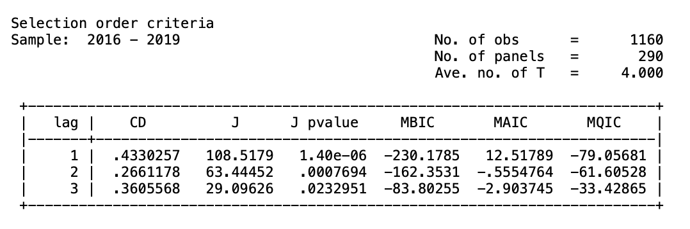
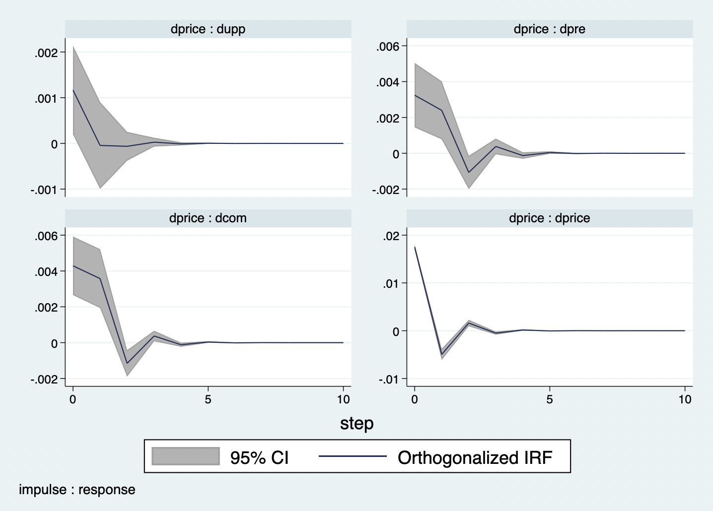
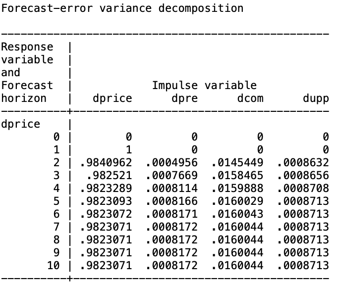

# PVAR model in Stata
_Data source: Statistics Sweden(SCB)_

We will use the demographic data as an example to build the PVAR model. The time period is from 2011-2020 and the cross sections are 290 Swedish municipalities.
```markdown
* use data2.dta, clear
```
We set the panel data identifier here.
```markdown
* xtset code year
```
Panel variable: code (strongly balanced)

Time variable: year, 2011 to 2020
 
Delta: 1 unit

Before building the PVAR model, we need to do some diagnostic tests.

1. Multicollinearity test

Multicollinearity problems may occur in the linear regression models. It can leads to bias in the regression results due to the interaction between variables.
To ensure that this problem does not exist among the variables, the VIF factor is generally set to less than 5.
We first run a simple linear regression model as population density is the dependent variable.
```markdown
* regress pop_den edu_rate dipo_inc inmi_rate employ_rate
* vif
```


All the VIF factors are smaller than 5, there is no multicollinearity problem.

2. Unit root tests

Most time series are volatile. We need run the panel unit root test to determine the stability of the data.
We first remove the cross-sectional dependence by the "_demean_" option. For the annually data, we set the lag = 1.

```markdown
* xtunitroot llc pop_den, demean lags(1)
* xtunitroot llc edu_rate, demean lags(1)
* xtunitroot llc dipo_inc, demean lags(1)
* xtunitroot llc inmi_rate, demean lags(1)
* xtunitroot llc employ_rate, demean lags(1)
```
When the p-value is smaller than 0.05, we can reject the null hypothesis at 95% significant level, which means that the data is stationary.


For the common unit root test, all the variables are stationary at 95% significant level. Now we can check if they have the individual unit roots by performing the ADF Test.

```markdown
* xtunitroot fisher pop_den, dfuller demean lags(1)
* xtunitroot fisher edu_rate, dfuller demean lags(1)
* xtunitroot fisher dipo_inc, dfuller demean lags(1)
* xtunitroot fisher inmi_rate, dfuller demean lags(1)
* xtunitroot fisher employ_rate, dfuller demean lags(1)
```


For the employment rate and education rate, we cannot conclude that they are stationary based on the p-value > 0.05. 
The first-order difference of all variables will be taken and tested again.

```markdown
# identify new index variables
* gen dedu = d.edu_rate
* gen dinm = d.inmi_rate
* gen dpop = d.pop_den
* gen dinc = d.dipo_inc
* gen demp = d.employ_rate
# test for variables I(1)
* xtunitroot fisher dedu, dfuller demean lags(1)
* xtunitroot fisher demp, dfuller demean lags(1)
```


Now all the variables are stationary. We can check if they have the long-term cointegration relationship.

3. Kao(1999) test
```markdown
* xtcointtest kao dpop dedu dinm demp dinc
```


We can conlcude that at 95% significant level, all panels are cointegrated.

4. Optimal lag 

We use the Modified AIC,BIC and HQ to choose the best lag. For the annually data the lag should be smaller than 2 because we want to keep the degrees of freedom.

```markdown
* pvarsoc dpop dedu dinm demp dinc,maxlag(3) pvaropts(instl(1/4))
```


The best lag should be 1.

5. Build the PVAR model

Because GMM-style panel vector autoregressive models treat all variables as endogenous so we will not contain instruments variables. 
To avoid possible autoregression and heteroskedasticity problems in the residuals, we choose _cluster robust error_ to capture the common factors among municipalities.

```markdown
* pvar dpop dedu dinm demp dinc,lags(1) instl(1/1) gmmstyle fod vce(cluster code)
```


The results from the partial PVAR model show that the amount of population density growth in the previous period has a positive effect on the current period itself. 
The coefficients of the remaining variables are very low, which indicate they do not have significant effects on the current population density growth.


6. Granger causality test
```markdown
* pvargranger
```


The results of Granger's causality test demonstrate whether one time series is sufficient to be used to predict another. 
When the p-value is less than 0.05 we consider that we can reject the null hypothesis that there is no Granger causality between the variables. 
Taking population density as an example, there does not seem to be a variable associated with it. 
As for the amount of increase in education rate, both homeowner disposable income and education rate can be considered as its Granger causes.


7. Impulse response

We firstly check when one standard deviation shock is applied on other variables, how the population density will react in the next ten periods.
```markdown
* pvarirf, oirf mc(200) res(dpop) byoption(yrescale)
```


Now we apply one standard deviation shock on the population density I(1).
```markdown
* pvarirf, oirf mc(200) imp(dpop) byoption(yrescale)
```


Based on the confidence intervals derived from two hundred Monte Carlo simulation analyses, the response of the growth of population density to the other variables is not significant. 

8. Variance decomposition
We set the time priod equals to 10 years. 
```markdown
* pvarfevd, step(10) mc(200) porder(dpop dedu dinm demp dinc)
```


Combining the PVAR model outputs with the results of Granger causality shows that the change in population density growth within the next decade is relatively independent, with 99.97% dominated by itself.

